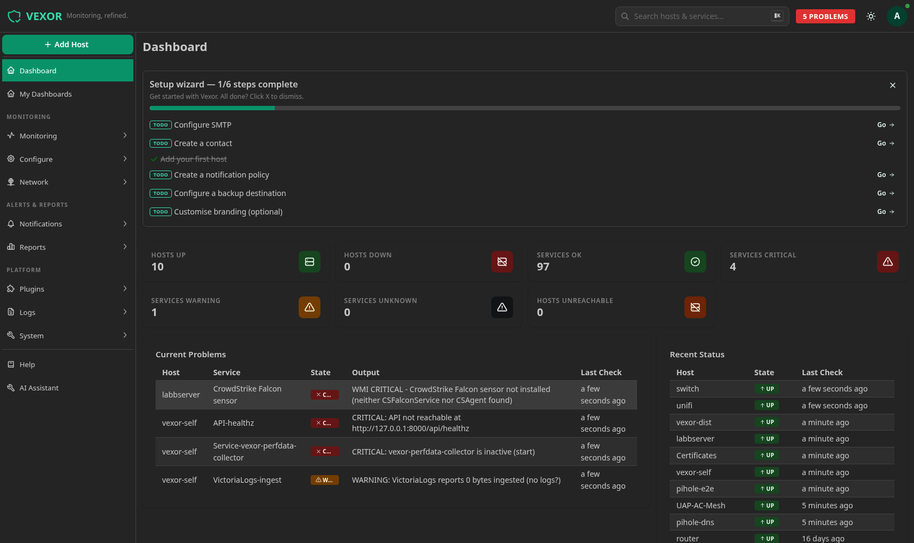
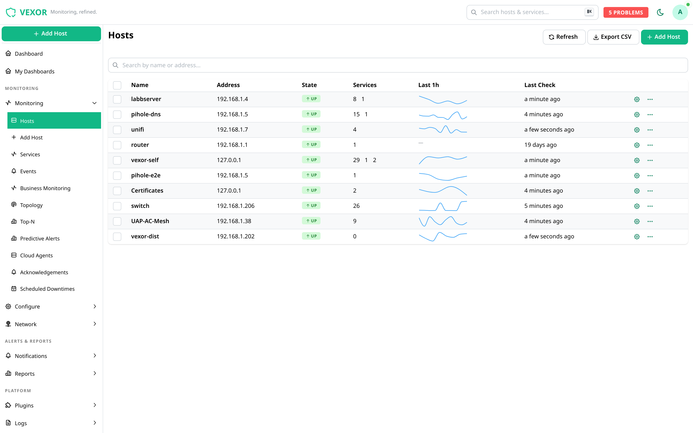
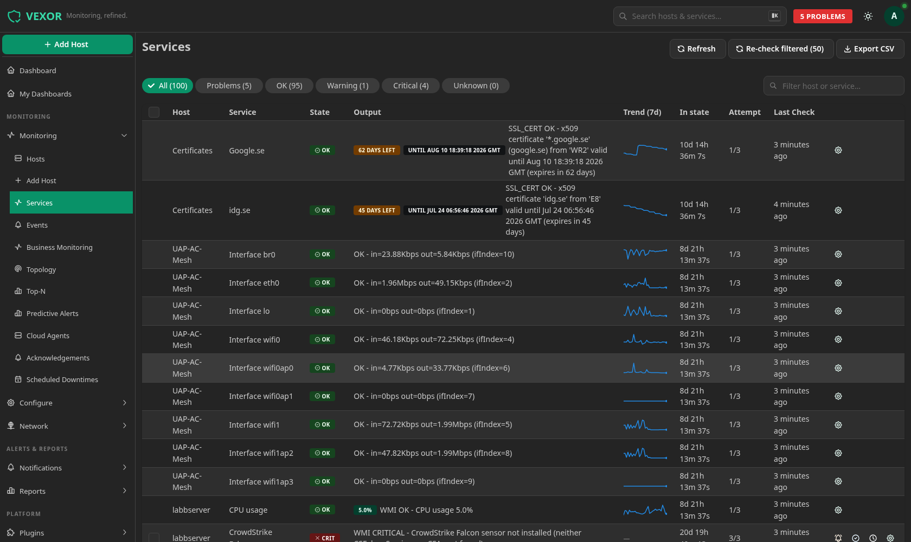
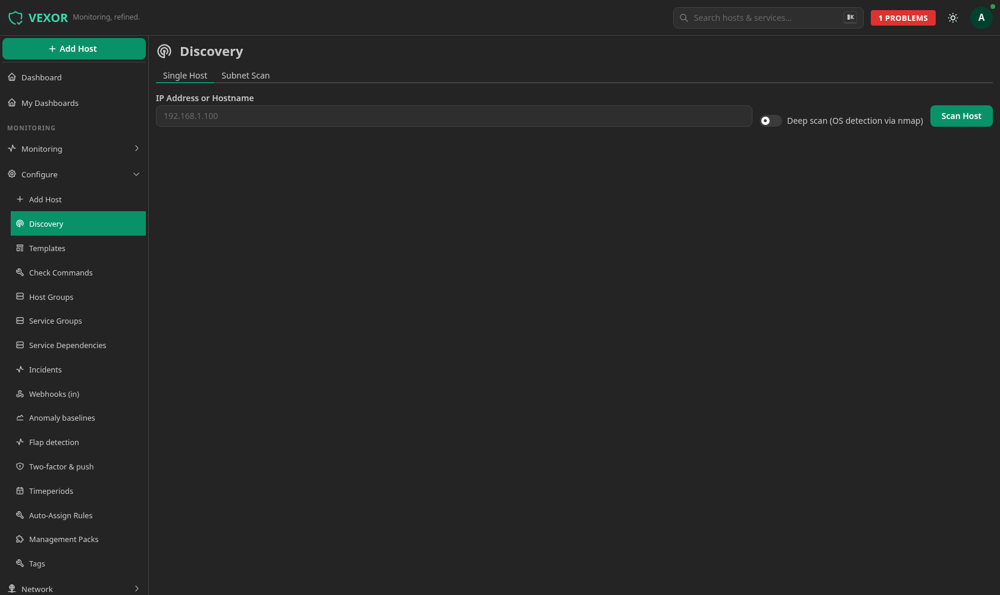
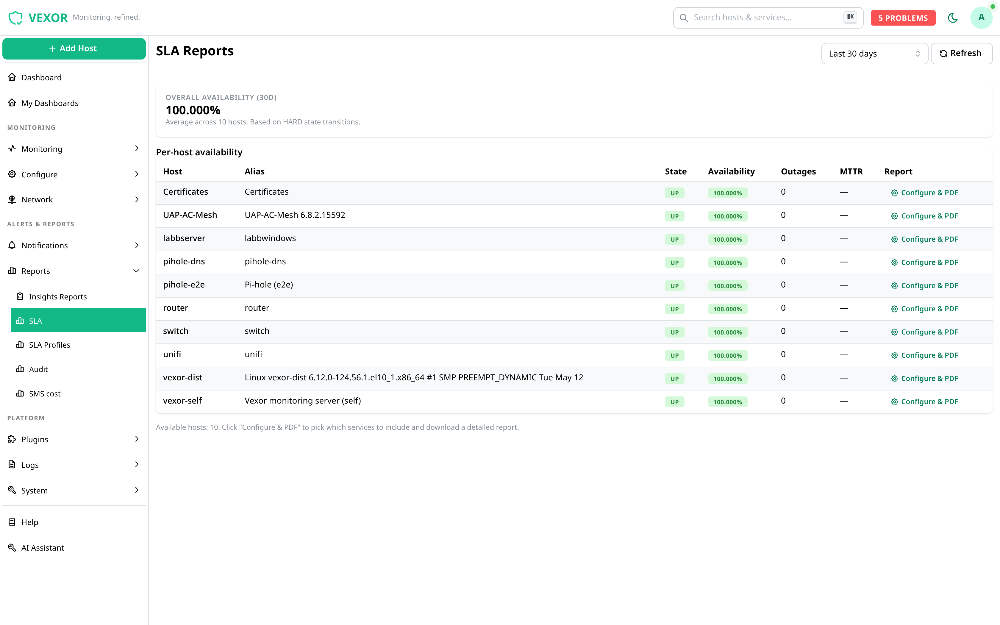
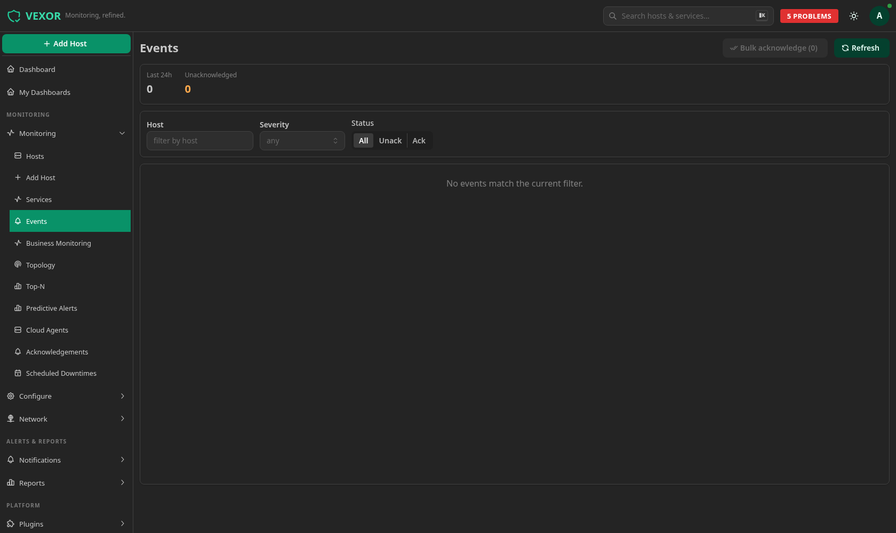
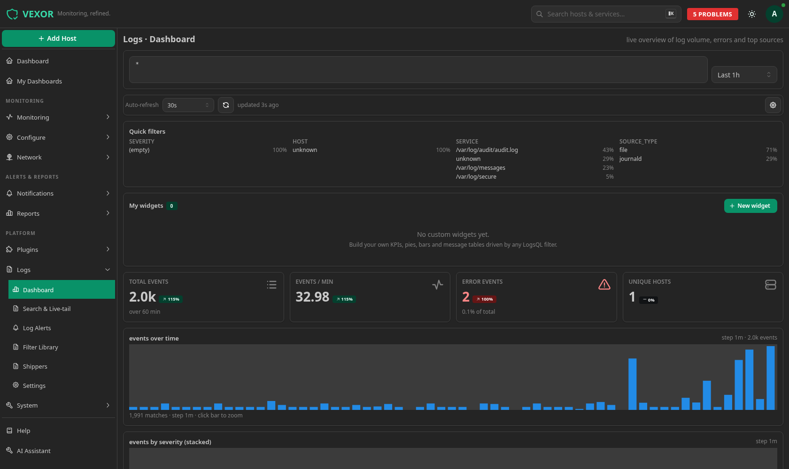
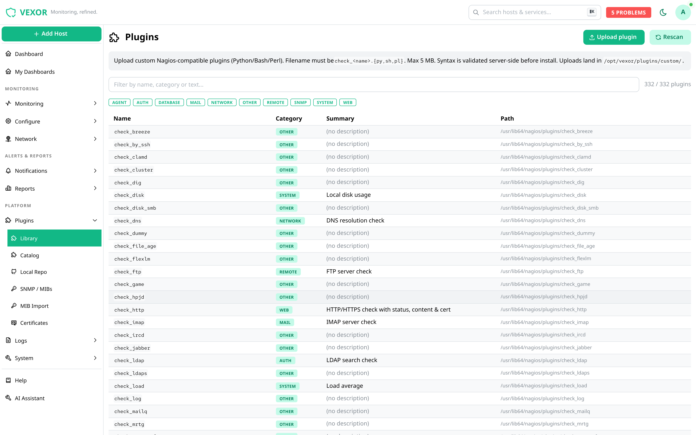
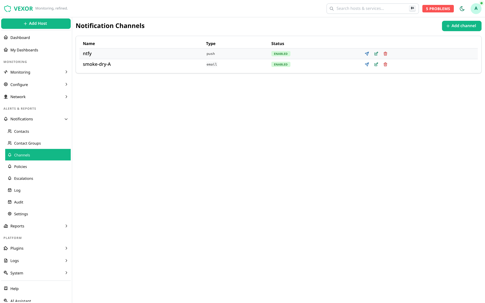
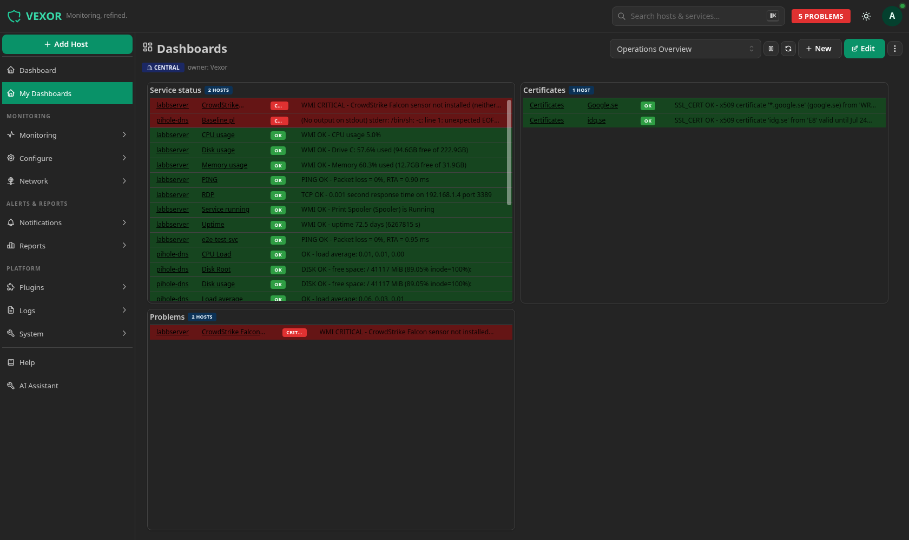

<div align="center">

# 🛡️ Vexor Monitoring

### Monitoring, refined.

A modern, all-in-one infrastructure monitoring platform — fast to deploy,
effortless to operate, and built on a battle-tested open-source core.

**Hosts &amp; services · network discovery · agent deployment · SLA reporting ·
notifications · log management · dashboards · AI assistant**

**[🌐 Website](https://vexormon.com)** · **[🚀 Live demo](https://demo.vexormon.com)** · **[📦 Install](#-installation)** · **[🐳 Docker](https://github.com/sayonarase/vexor-docker)**

_Try the live demo at **[demo.vexormon.com](https://demo.vexormon.com)** — sign in with `demo` / `demo`. Read-only, resets hourly._

</div>

---

## ✨ What is Vexor?

Vexor is a commercial monitoring platform for servers, network devices and
applications. It pairs a proven [Naemon](https://www.naemon.org/) monitoring
core with a modern web interface, automatic discovery, agent deployment and
enterprise reporting — so you can go from a fresh server to a fully monitored
environment in minutes.

This repository is the **public landing page** for Vexor. It contains
screenshots, installation instructions, and the End-User License Agreement. A
**700-day Enterprise evaluation license ships pre-installed**, so fresh
installs are fully licensed out of the box — no manual activation step.

> The full website lives at **[vexormon.com](https://vexormon.com)**, and you can
> try a hosted instance at **[demo.vexormon.com](https://demo.vexormon.com)**
> (`demo` / `demo`, read-only, resets hourly).

> Looking to install? Jump to **[Installation](#-installation)**.

---

## 🚀 Highlights

| | Feature |
|---|---|
| 🧭 | **Effortless host onboarding** — add a host in seconds. Vexor scans it for ping, SSH, FTP, RDP, HTTP/S, SNMP and other standard services and proposes a baseline of checks to enable. |
| 🛰️ | **Agent deployment from the GUI** — push the monitoring agent (NSClient++/NRPE on Windows, NRPE on Linux) straight from the web UI, with the option to bundle additional packages. |
| 🔎 | **Smart agent detection** — already have an agent on the target? Vexor detects it and offers the extra checks it unlocks, ready to tick on. |
| 📊 | **SLA reports** — per-host availability, MTTR and outage counts based on real HARD-state history, exportable to PDF. |
| 🔔 | **Notifications &amp; escalations** — flexible policies, contact groups, on-call escalation, quiet hours and failover, across multiple channels: email, SMS, webhook (Slack/Teams/PagerDuty) and mobile push (ntfy/Gotify). |
| 🧩 | **Plugin catalog** — a curated, license-cleared library of monitoring plugins, installable from the UI. |
| 🌐 | **Network discovery** — scan a single host or a whole subnet, with optional deep (OS-detection) scans. |
| 🧠 | **Business Service Monitoring** — roll low-level checks up into the services your business actually cares about. |
| 📈 | **Predictive &amp; anomaly alerts** — baselines and forecasting to catch problems before they page you. |
| 🗂️ | **Integrated log management** — ship, search and alert on logs alongside your metrics. |
| 🤖 | **AI assistant** — built-in LLM help for triage and configuration. |
| 🔐 | **Enterprise auth** — single sign-on via Keycloak (LDAP/Active Directory, OIDC), two-factor auth and role-based access control. |

---

## 📸 Screenshots

### Dashboard
At-a-glance health, current problems and a guided setup wizard.



### Hosts
Live state, per-host service counts and inline sparklines.



### Services


### Discovery — add &amp; scan a host
Scan a single host or an entire subnet for standard services.



### SLA reports
Per-host availability, MTTR and outages — export to PDF.



### Events


### Log management


### Plugin catalog


### Notification policies


### Custom dashboards


---

## 💿 Installation

> ### ✅ Supported platform
> **Rocky Linux 10** — or any **RHEL 10-compatible** distribution
> (AlmaLinux 10, RHEL 10, Oracle Linux 10), **x86_64** architecture.
> This is the only platform the public packages are built and tested for.
> EL9 / other distributions are **not** supported by the public release.

On a fresh server, the whole stack installs in three commands — see
**[INSTALL.md](INSTALL.md)** for the full guide.

```bash
# 1. Bootstrap the Vexor + dependency repositories
dnf install -y https://repo.vexormon.com/vexor-release-latest-el$(rpm -E %rhel).rpm

# 2. Install the full server (API, UI, monitoring core, auth, databases, ...)
dnf install -y vexor-server

# 3. First-run setup (databases, passwords, SSO, services, firewall)
vexor-setup
```

Then open `https://<your-server>/` in a browser and log in with the admin
credentials printed by `vexor-setup`.

### 🐳 Alternative: run anywhere with Docker

Not on Rocky / RHEL 10? The same stack is also published as an **all-in-one
Docker image**, so you can evaluate Vexor on any Linux host with Docker
(Ubuntu, Debian, …). It runs the **identical RPMs** under systemd inside a
single container — nothing is re-implemented.

```bash
git clone https://github.com/sayonarase/vexor-docker
cd vexor-docker
cp .env.example .env        # set VEXOR_PUBLIC_URL to how you'll reach it (incl. port)
docker compose up -d
docker compose exec vexor cat /etc/vexor/.initial-admin   # initial admin login
```

Image: `ghcr.io/sayonarase/vexor:latest` · source &amp; docs:
**[sayonarase/vexor-docker](https://github.com/sayonarase/vexor-docker)**.

> Rocky / RHEL 10 (above) remains the officially supported production platform.
> The Docker image is a convenience for evaluation and non-RHEL hosts.

---

## 🔑 Free 700-day evaluation license

A signed **Enterprise** evaluation license ships **pre-installed** — fresh
installs are fully licensed out of the box, with **no manual step required**:

- **License ID:** `VX-2026-4B3ED6`
- **Edition:** Enterprise · **Host limit:** unlimited
- **Valid until:** 2028-05-08

It is bundled with `vexor-api`, so after `vexor-setup` the platform is already
running on the trial license. You can confirm it under **Settings → License** in
the web UI.

If you ever need to (re)install it manually — e.g. to restore it after replacing
the file — the license is also attached to every [Release](../../releases) and
lives at [`vexor-trial-700d-unlimited.lic`](vexor-trial-700d-unlimited.lic):

```bash
install -m 0640 -o root -g vexor vexor-trial-700d-unlimited.lic /etc/vexor/license.lic
systemctl restart vexor-api
```

> The pre-built **RPMs attached to each Release are for EL10 (Rocky/RHEL 10),
> x86_64** only.  They are a fallback download for when the primary repo server
> is unavailable — see [INSTALL.md](INSTALL.md#fallback-install-from-github-if-the-vexor-repo-is-down).

---

## 📦 What's in a Vexor install

Vexor bundles and integrates a number of components. Its own application code
(the API and web UI) is **proprietary**; the monitoring core and bundled
plugins are open source under their respective licenses:

- **Monitoring core:** Naemon (GPL-2.0)
- **Bundled plugins:** a curated set of GPL/MIT/BSD/Apache-licensed checks —
  see the [Vexor plugin catalog](https://github.com/sayonarase/vexor-plugin-catalog)
- **Metrics &amp; logs:** time-series and log back-ends for trends and search
- **Auth:** Keycloak for SSO/LDAP/OIDC and 2FA

Corresponding source for redistributed GPL components is made available as
required by their licenses.

---

## 📄 License

Vexor is **commercial software**. Use of the platform is governed by the
**[End-User License Agreement (EULA)](EULA.md)**. The included evaluation
license is provided free of charge for testing and evaluation purposes.

For production licensing and pricing, please get in touch.

---

## 🐛 Feedback &amp; security

- **Found a bug or have a feature request?** Open an [issue](../../issues).
- **Security report?** Please follow **[SECURITY.md](SECURITY.md)** — do not
  file public issues for vulnerabilities.

---

<div align="center">
<sub>© 2026 Vexor. All rights reserved. Vexor is a trademark of its respective owner.</sub>
</div>
